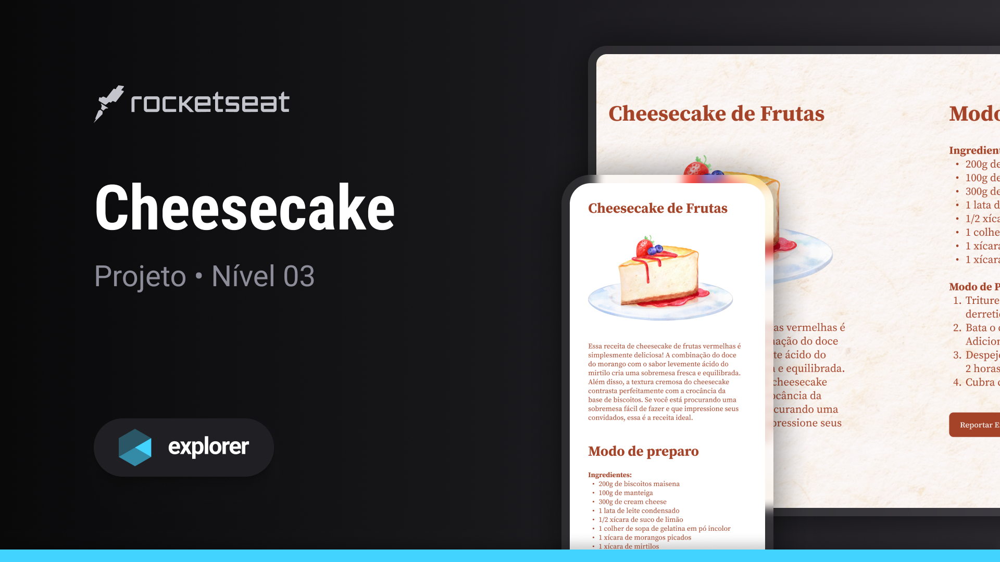
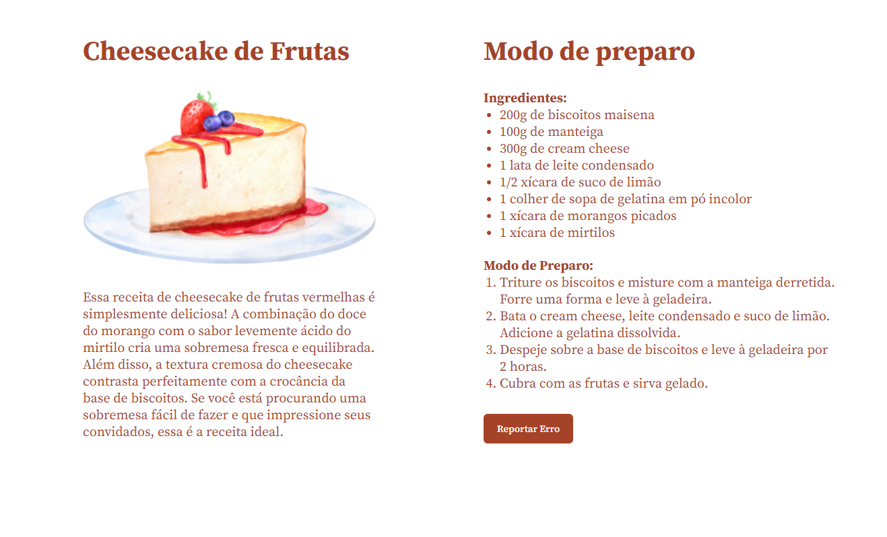
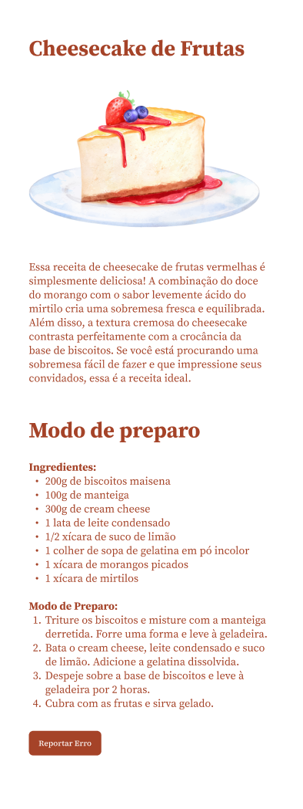

# cheesecake-de-frutas

## Sobre o projeto

Este projeto consiste em uma interface web simples, construída como parte da trilha Explorer oferecida pela Rocketseat.
O objetivo principal é abordar conceitos fundamentais de responsividade para diferentes telas de dispositivos móveis.
Durante as aulas, foram aplicados os seguintes conceitos:

Conceitos aplicados
* Apresentação do Projeto destacando a importância da responsividade
* Introduzindo regras mobile first
* Unidade de Medida Relativa (REM)

## Layout do projeto
<table>
  <tr>
    <td></td>
    <td></td>
  </tr>   
</table>

## Tecnologias
- HTML
- CSS
- Figma
